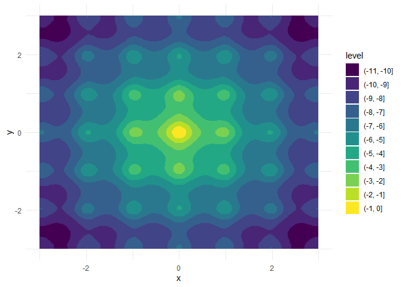

<!-- README.md is generated from README.Rmd. Please edit that file -->

# optimizeR 

<!-- badges: start -->

[](https://CRAN.R-project.org/package=optimizeR)
[](https://cran.r-project.org/package=optimizeR)
[](https://github.com/loelschlaeger/optimizeR/actions)
[](https://app.codecov.io/gh/loelschlaeger/optimizeR?branch=master)
<!-- badges: end -->

The `{optimizeR}` package

- provides an object-oriented framework for optimizer functions in R
- and offers some convenience for useRs when minimizing or maximizing.

❌ **You won’t need the package if you…**

- already know which optimizer you want to use and if you are happy with
  its constraints (e.g., only minimization over the first function
  argument possible),
- want to compare optimizers that are already covered by
  [`{optimx}`](https://CRAN.R-project.org/package=optimx) (Nash and
  Varadhan 2011) (they provide a framework to compare about 30
  optimizers),
- or search for new optimization algorithms (because this package does
  not implement any optimizer functions itself).

✅ **But you might find the package useful if you want to…**

- compare any optimizer function (also those not covered by `{optimx}`
  or other frameworks; see the [CRAN Task View: Optimization and
  Mathematical
  Programming](https://CRAN.R-project.org/view=Optimization)
  (Schwendinger and Borchers 2023) for an overview of R optimizers),
- have consistently named inputs and outputs across different optimizers
  (which is generally not the case),
- view optimizers as objects (which can be helpful when implementing
  packages that depend on optimization),
- use optimizers for both minimization and maximization,
- optimize over more than one function argument,
- measure computation time or set a time limit for long optimization
  tasks.

## How to use the package?

The following demo is a bit artificial but showcases the package
purpose. Let’s assume we want to

- maximize a function over two of its arguments,
- interrupt optimization if it exceeds 10 seconds,
- and compare the performance between the optimizers `stats::nlm` and
  `pracma::nelder_mead`.

We can easily do this task with `{optimizeR}`:

``` r
library("optimizeR")
```

**1. Define the objective function**

Let $f:\mathbb{R}^4\to\mathbb{R}$ with

``` r
f <- function(a, b, x, y) {
  a * exp(-0.2 * sqrt(0.5 * (x^2 + y^2))) + exp(0.5 * (cos(2 * pi * x) + cos(2 * pi * y))) - exp(1) - b
}
```

For `a = b = 20`, this is the inverted [Ackley
function](https://en.wikipedia.org/wiki/Ackley_function) with a global
maximum in `x = y = 0`:



We want to keep `a` and `b` fixed here and optimize over `x` and `y`
(which are also both single numeric values).

Two problems would occur if we would optimize `f` with say `stats::nlm`
directly:

1.  there are two target arguments (`x` and `y`) and
2.  the position of the target argument is not in the first place.

Both artifacts are not allowed by `stats::nlm` and most of other
available optimizers, but supported by `{optimizeR}`. We just have to
define an objective object which we later can pass to the optimizers:

``` r
objective <- Objective$new(
  f = f,                 # f is our objective function
  target = c("x", "y"),  # x and y are the target arguments
  npar = c(1, 1),        # the target arguments have both a length of 1
  "a" = 20,              
  "b" = 20               # a and b have fixed values
)
```

**2. Create the optimizer objects**

Now that we have defined the objective function, let’s define our
optimizer objects. For `stats::nlm`, this is a one-liner:

``` r
nlm <- Optimizer$new(which = "stats::nlm")
```

The `{optimizeR}` package provides a dictionary of optimizers, that can
be directly selected via the `which` argument. For an overview of
available optimizers, see:

``` r
optimizer_dictionary
#> <Dictionary> optimizer algorithms 
#> Keys: 
#> - lbfgsb3c::lbfgsb3c
#> - stats::nlm
#> - stats::nlminb
#> - stats::optim
#> - ucminf::ucminf
```

But in fact any optimizer that is not contained in the dictionary can be
put into the `{optimizeR}` framework by setting `which = "custom"`
first…

``` r
nelder_mead <- Optimizer$new(which = "custom")
#> Please use method `$definition()` next to define a custom optimizer.
```

… and using the `$definition()` method next:

``` r
nelder_mead$definition(
  algorithm = pracma::nelder_mead, # the optimization function
  arg_objective = "fn",            # the argument name for the objective function
  arg_initial = "x0",              # the argument name for the initial values
  out_value = "fmin",              # the element for the optimal function value in the output
  out_parameter = "xmin",          # the element for the optimal parameters in the output
  direction = "min"                # the optimizer minimizes
)
```

**3. Set a time limit**

Each optimizer object has a field called `$seconds` which equals `Inf`
by default. You can optionally set a different, single numeric value
here to set a time limit in seconds for the optimization:

``` r
nlm$seconds <- 10
nelder_mead$seconds <- 10
```

Note that not everything (especially compiled C code) can technically be
timed out, see the help site `help("withTimeout", package = "R.utils")`
for more details.

**4. Maximize the objective function**

Each optimizer object has the two methods `$maximize()` and
`$minimize()` for function maximization or minimization, respectively.
Both methods require values for the two arguments

1.  `objective` (either an objective object as defined above or just a
    function) and
2.  `initial` (an initial parameter vector from where the optimizer
    should start)

and optionally accepts additional arguments to be passed to the
optimizer or the objective function.

``` r
nlm$maximize(objective = objective, initial = c(3, 3))
#> $value
#> [1] -6.559645
#> 
#> $parameter
#> [1] 1.974451 1.974451
#> 
#> $seconds
#> [1] 0.01002908
#> 
#> $initial
#> [1] 3 3
#> 
#> $error
#> [1] FALSE
#> 
#> $gradient
#> [1] 5.757896e-08 5.757896e-08
#> 
#> $code
#> [1] 1
#> 
#> $iterations
#> [1] 6
```

``` r
nelder_mead$maximize(objective = objective, initial = c(3, 3))
#> $value
#> [1] 0
#> 
#> $parameter
#> [1] 0 0
#> 
#> $seconds
#> [1] 0.005402327
#> 
#> $initial
#> [1] 3 3
#> 
#> $error
#> [1] FALSE
#> 
#> $count
#> [1] 105
#> 
#> $info
#> $info$solver
#> [1] "Nelder-Mead"
#> 
#> $info$restarts
#> [1] 0
```

Note that

- the inputs for the objective function and initial parameter values are
  named consistently across optimizers,

- the output values for the optimal parameter vector and the maximimum
  function value are also named consistently across optimizers,

- the output contains the initial parameter values and the optimization
  time in seconds and additionally other optimizer-specific elements,

- `pracma::nelder_mead` outperforms `stats::nlm` here both in terms of
  optimization time and convergence to the global maximum.

## How to get the access?

You can install the released package version from
[CRAN](https://CRAN.R-project.org) with:

``` r
install.packages("optimizeR")
```

Then load the package via `library("optimizeR")` and you should be ready
to go.

## Roadmap

The following steps to further improve the package are currently on our
agenda:

- [ ] The package already provides a dictionary that stores optimizers
  together with information about names of their inputs and outputs (see
  the `optimizer_dictionary` object). We want to extend this dictionary
  with more optimizers that are commonly used.

- [ ] We want to use alias for optimizers in the dictionary that group
  optimizers into classes (such as “unconstrained optimization”,
  “constrained Optimization”, “direct search”, “Newton-type” etc.). This
  would help to find alternative optimizers for a given task.

- [ ] We want to implement a `$summary()` method for an optimizer object
  that gives an overview of the optimizer, its arguments, and its
  properties.

## Getting in touch

You have a question, found a bug, request a feature, want to give
feedback, or like to contribute? It would be great to hear from you,
[please file an issue on
GitHub](https://github.com/loelschlaeger/optimizeR/issues/new/choose).
😊

## References

<div id="refs" class="references csl-bib-body hanging-indent"
entry-spacing="0">

<div id="ref-optimx" class="csl-entry">

Nash, John C., and Ravi Varadhan. 2011. “Unifying Optimization
Algorithms to Aid Software System Users:
<span class="nocase">optimx</span> for R.” *Journal of Statistical
Software* 43 (9): 1–14. <https://doi.org/10.18637/jss.v043.i09>.

</div>

<div id="ref-taskview" class="csl-entry">

Schwendinger, F., and H. W. Borchers. 2023. “CRAN Task View:
Optimization and Mathematical Programming.”
<https://CRAN.R-project.org/view=Optimization>.

</div>

</div>
