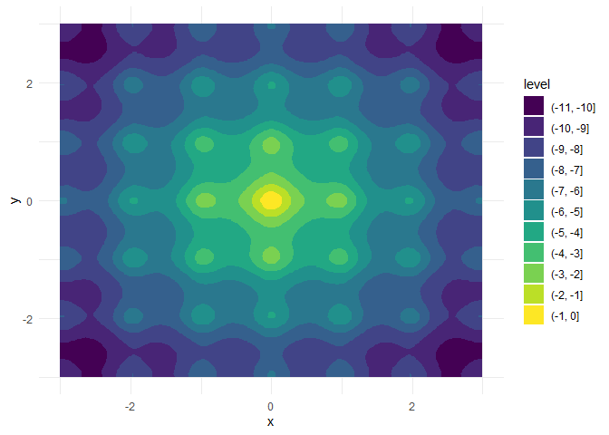

# optimizeR

The [optimizeR](https://loelschlaeger.de/optimizeR/) package provides an
object-oriented framework for optimizer functions in R and adds
convenience features for minimization and maximization.

**You probably do not need this package if you…**

- already know which optimizer you want to use and are comfortable with
  its constraints, such as minimization only over the first function
  argument;
- want to compare optimizers that are already covered by
  [`{optimx}`](https://CRAN.R-project.org/package=optimx), a framework
  for comparing about 30 optimizers;
- are searching for new optimization algorithms, because this package
  does not implement optimizer functions itself.

**You might find the package useful if you want to…**

- compare optimizer functions not covered by
  [optimx](https://github.com/nashjc/optimx) or other frameworks (see
  the [CRAN Task View: Optimization and Mathematical
  Programming](https://CRAN.R-project.org/view=Optimization) for an
  overview);
- have consistently named inputs and outputs across different
  optimizers;
- view optimizers as objects, which can help when implementing packages
  that depend on optimization;
- use optimizers for both minimization and maximization,
- optimize over more than one function argument,
- measure computation time or set a time limit for long optimization
  tasks.

## How to use the package?

The following demo is a bit artificial, but it showcases the package
purpose. Assume we want to

- maximize a function over two of its arguments,
- interrupt optimization if it exceeds 10 seconds,
- compare the performance of
  [`stats::nlm`](https://rdrr.io/r/stats/nlm.html) and
  [`pracma::nelder_mead`](https://rdrr.io/pkg/pracma/man/neldermead.html).

We can do this task with
[optimizeR](https://loelschlaeger.de/optimizeR/). You can install the
released package version from [CRAN](https://CRAN.R-project.org) with:

``` r

install.packages("optimizeR")
```

Then load the package via
[`library("optimizeR")`](https://loelschlaeger.de/optimizeR/).

**1. Define the objective function**

Let $`f:\mathbb{R}^4\to\mathbb{R}`$ with

``` r

f <- function(a, b, x, y) {
  a * exp(-0.2 * sqrt(0.5 * (x^2 + y^2))) + exp(0.5 * (cos(2 * pi * x) + cos(2 * pi * y))) - exp(1) - b
}
```

For `a = b = 20`, this is the negative [Ackley
function](https://en.wikipedia.org/wiki/Ackley_function) with a global
maximum in `x = y = 0`:



We want to keep `a` and `b` fixed here and optimize over `x` and `y`,
which are both single numeric values.

Two problems would occur if we optimized `f` directly with, say,
[`stats::nlm`](https://rdrr.io/r/stats/nlm.html):

1.  There are two target arguments (`x` and `y`).
2.  The target arguments are not the first arguments of `f`.

Both features are unsupported by
[`stats::nlm`](https://rdrr.io/r/stats/nlm.html) and most other
optimizers, but they are supported by
[optimizeR](https://loelschlaeger.de/optimizeR/). We just have to define
an objective object that we can later pass to the optimizers:

``` r

objective <- Objective$new(
  f = f,                 # f is our objective function
  target = c("x", "y"),  # x and y are the target arguments
  npar = c(1, 1),        # the target arguments have both a length of 1
  "a" = 20,              
  "b" = 20               # a and b have fixed values
)
```

**2. Create the optimizer objects**

Now that we have defined the objective function, let’s define the
optimizer objects. For [`stats::nlm`](https://rdrr.io/r/stats/nlm.html),
this is a one-liner:

``` r

nlm <- Optimizer$new(which = "stats::nlm")
```

The [optimizeR](https://loelschlaeger.de/optimizeR/) package provides a
dictionary of optimizers that can be selected directly via the `which`
argument. For an overview of available optimizers, see:

``` r

optimizer_dictionary
#> <Dictionary> optimization algorithms 
#> Keys: 
#> - lbfgsb3c::lbfgsb3c
#> - lbfgsb3c::lbfgsb3
#> - lbfgsb3c::lbfgsb3f
#> - lbfgsb3c::lbfgsb3x
#> - stats::nlm
#> - stats::nlminb
#> - stats::optim
#> - ucminf::ucminf
```

Any optimizer that is not contained in the dictionary can still be put
into the [optimizeR](https://loelschlaeger.de/optimizeR/) framework by
setting `which = "custom"` first:

``` r

nelder_mead <- Optimizer$new(which = "custom")
#> Use method `$definition()` next to define a custom optimizer.
```

Then use the `$definition()` method:

``` r

nelder_mead$definition(
  algorithm = pracma::nelder_mead, # the optimization function
  arg_objective = "fn",            # the objective function argument name
  arg_initial = "x0",              # the argument name for the initial values
  out_value = "fmin",              # the optimal function value element
  out_parameter = "xmin",          # the optimal parameter element
  direction = "min"                # the optimizer minimizes
)
```

**3. Set a time limit**

Each optimizer object has a field called `$seconds`, which equals `Inf`
by default. You can set a different single numeric value to define a
time limit in seconds for the optimization:

``` r

nlm$seconds <- 10
nelder_mead$seconds <- 10
```

Note that not everything, especially compiled C code, can technically be
timed out. See the help page `help("withTimeout", package = "R.utils")`
for more details.

**4. Maximize the objective function**

Each optimizer object has the methods `$maximize()` and `$minimize()`
for function maximization and minimization, respectively. Both methods
require values for two arguments:

1.  `objective` (either an objective object as defined above or just a
    function) and
2.  `initial` (an initial parameter vector where the optimizer should
    start)

They optionally accept additional arguments for the objective function.
Optimizer-specific arguments should be set when creating the optimizer
object or via `$set_arguments()`.

``` r

nlm$maximize(objective = objective, initial = c(3, 3))
#> $value
#> [1] -6.559645
#> 
#> $parameter
#> [1] 1.974451 1.974451
#> 
#> $seconds
#> [1] 0.04005599
#> 
#> $initial
#> [1] 3 3
#> 
#> $error
#> [1] FALSE
#> 
#> $gradient
#> [1] 5.757896e-08 5.757896e-08
#> 
#> $code
#> [1] 1
#> 
#> $iterations
#> [1] 6
```

``` r

nelder_mead$maximize(objective = objective, initial = c(3, 3))
#> $value
#> [1] 0
#> 
#> $parameter
#> [1] 0 0
#> 
#> $seconds
#> [1] 0.02831006
#> 
#> $initial
#> [1] 3 3
#> 
#> $error
#> [1] FALSE
#> 
#> $count
#> [1] 105
#> 
#> $info
#> $info$solver
#> [1] "Nelder-Mead"
#> 
#> $info$restarts
#> [1] 0
```

Note that

- the inputs for the objective function and initial parameter values are
  named consistently across optimizers,

- the output values for the optimal parameter vector and maximum
  function value are also named consistently across optimizers,

- the output contains the initial parameter values, the optimization
  time in seconds, and other optimizer-specific elements,

- [`pracma::nelder_mead`](https://rdrr.io/pkg/pracma/man/neldermead.html)
  outperforms [`stats::nlm`](https://rdrr.io/r/stats/nlm.html) here both
  in optimization time and in convergence to the global maximum.

## Getting in touch

If you have any questions, found a bug, or need a feature, please [file
an issue on
GitHub](https://github.com/loelschlaeger/optimizeR/issues/new/choose).
